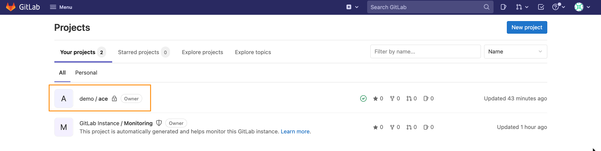
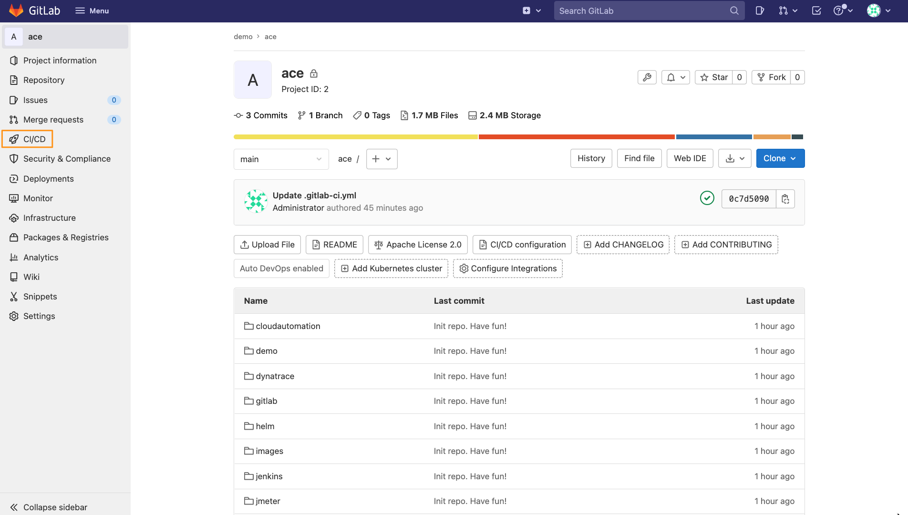
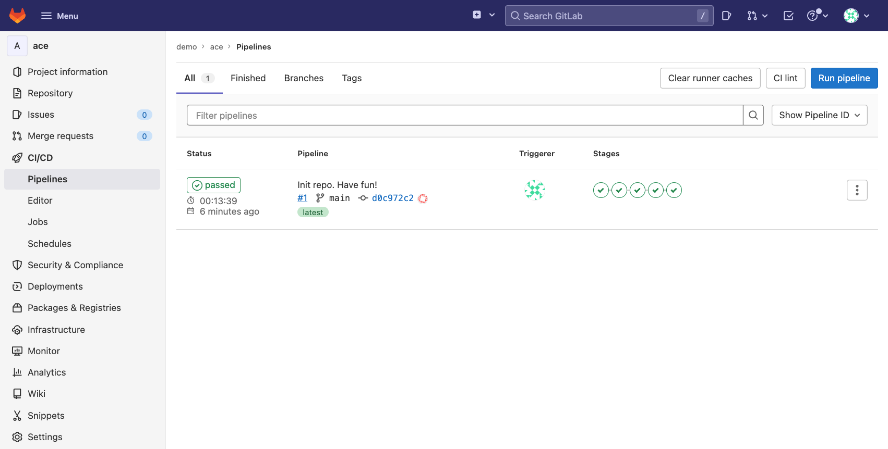

# Demo using GitLab
This document outlines how to demo ACE use cases using the ACE-BOX with **GitLab**.

## Demo overview
As part of this demo, we will use a set of multi-staged pipelines pre-deployed within GitLab. We will demonstrate MaaS, Monaco and Quality Gates.

## ACE Demo pipeline
1. Navigate to your GitLab instance. The link and credentials can be found on the ACE dashboard.
    
2. Within the GitLab UI, select the `demo/ace` project
3. Click on the `CI/CD` link in the left menu bar
    
4. You will see that the initial pipeline automatically started. Depending on how long it has been since the ACE-BOX was provisioned, it might have already finished
    

## Source code
All the pipelines and source code are stored in the ace-box's GitLab Repository server. The link and credentials can be found on the ACE dashboard. If you go back to the project's home, or select `Repository` in the left menu bar, you will have access to the source code

The following noteable files/folders exist:
- `helm/simplenodeservice` folder: contains the helm chart for the simplenodeservice
- `locust` folder: contains the test files
- `cloudautomation` folder: contains the quality gate configuration like sli and slo definitions
- `monaco` folder: contains the monaco configuration
- `app.js`: simplenodeservice application code. Note: the application does not get built each time in the GitLab demo, instead pre-built images are leveraged
- `Dockerfile`: simplenodeservice Dockerfile definition for building the container image
- `.gitlab-ci.yml`: The GitLab pipeline definition

## Starting the demo
As mentioned above, the first pipeline automatically triggers when GitLab gets deployed on the ACE-BOX. Follow the links below to get more details on what happens and how to perform the demo.
- [1. Successful Build](docs/1_successful_build.md) => Start here!
- [2. Failed Build](docs/2_failed_build.md)
- [3. Evaluation Explained](docs/3_evaluation_explained.md)