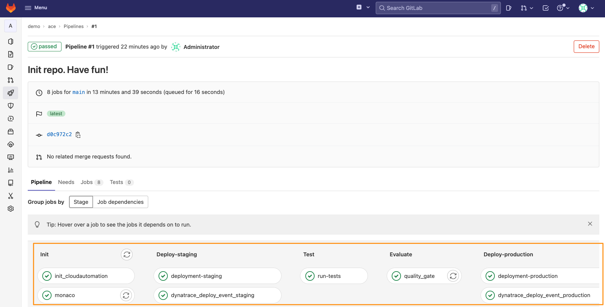
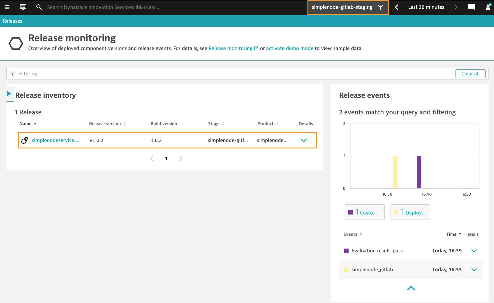
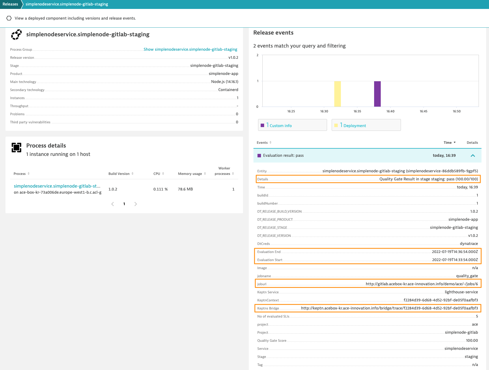
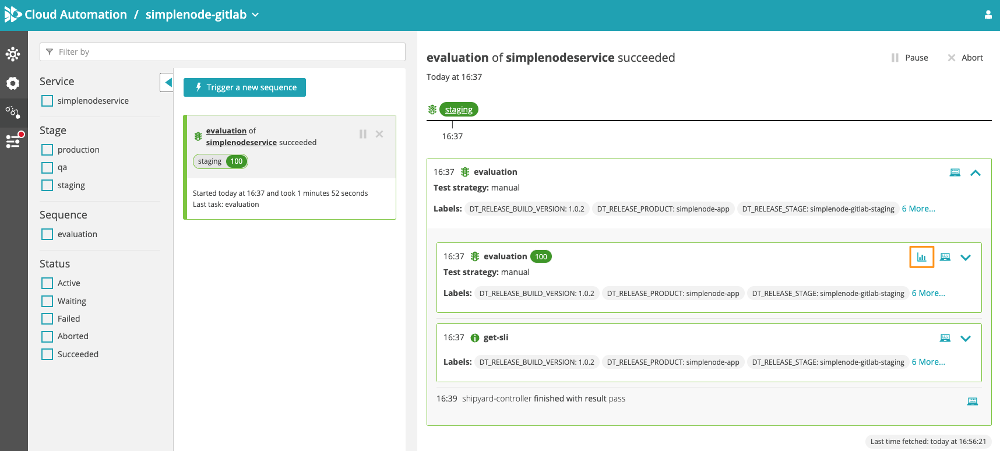
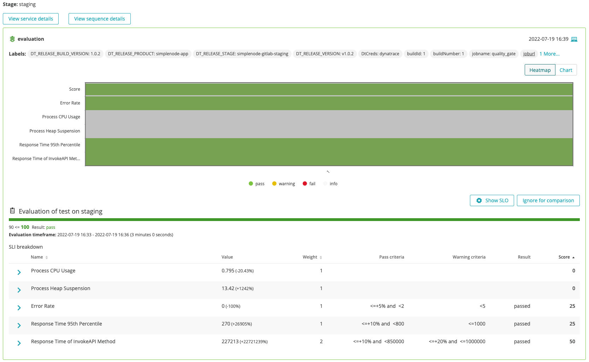

# 1. Successful Build

In this first step, we will outline the different phases of our CI configuration as well as show what happens in the background. At the end of this step, the simplenodeservice artifact will have been deployed and a quality gate will have been performed with a successful result.

> Note: Build numbers might differ from what you have in your environment. When creating documentation re-runs were performed.

## Pipeline steps

1. Navigate to `CI/CD` on the left menu and click on the first build.
    The screen presented will show you the overview of the pipeline, as well as the individual stages and jobs that were part of it.
    

2. The following stages and jobs can be observed:
    1. Stage `Init`
       1. Job `init_cloudautomation`: initializes Cloud Automation by ensuring the project/service/stage exists and uploading relevant files such as SLI and SLO definitons
       2. Job `monaco`: applies the relevant Dynatrace configuration that is stored in the `monaco/projects/simplenode-gitlab` folder within the repository
    2. Stage `Deploy-staging`  
       1. Job `deployment-staging` that deploys the simplenodeservice application using helm in the staging environment
       2. Job `dynatrace_deploy_event_staging` that sends a Deployment Event to Dynatrace indicating the act of deployment took place
    3. Stage `test` contains one job `run-tests` that leverages Locust to test the application. The configuration of the tests can be found in the `locust` folder within the repository
    4. Stage `evaluate` contains one job `quality_gate` which performs the Release Validation/Quality Gate
    5. Stage `Deploy-production`  
       1. Job `deployment-production` that deploys the simplenodeservice application using helm in the production environment
       2. Job `dynatrace_deploy_event_production` that sends a Deployment Event to Dynatrace indicating the act of deployment took place

3. By clicking on each job within the pipeline, it is possible to observe the logs of that execution

4. The `.gitlab-ci.yml` file contains the definition of the above steps

## Execution details

Once the pipeline has run completely, and normally successfully, it is now possible to observe the results of the evaluation.

We will start within Dynatrace

1. Navigate to the `Releases` screen
2. A Management Zone called `simplenode-gitlab-staging` was created, select it if you would like to filter out the other releases that might be present.
    
    > Note: if no events are visible, you might need to select a larger time frame
3. Click on the release in the `simplenode-gitlab-staging` environment
    
4. On the right you will see an overview of the Release Events: 1 deployment and 1 evaluation result with a **pass* score. Check out the details of the evaluation event, there are details on the score, time frame (when did the tests run), a link back to the GitLab pipeline run and also a link to the Keptn bridge with the evaluation details. Click on that link with the label `Keptn Bridge`.
    > Note: at the moment this link is not clickable, this will be fixed in the future.
5. Within the Bridge, click on the **Graph** icon which will bring you to the evaluation heatmap and details.
    
6. The release details shows you a heatmap of previous evaluations and the score, as well as the details of the currently selected evaluation.
    

## Next Steps
Navigate to [2. Failed Build](2_failed_build.md)