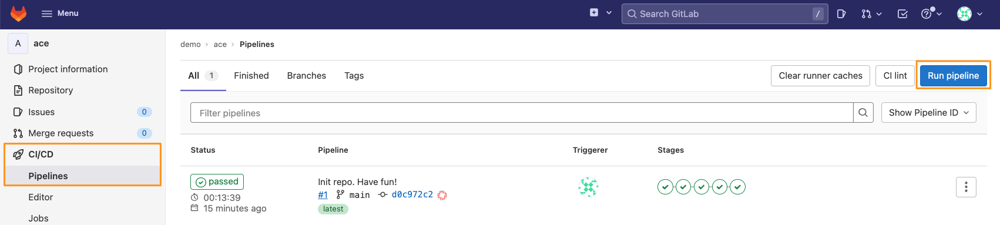
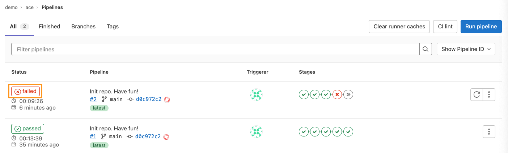
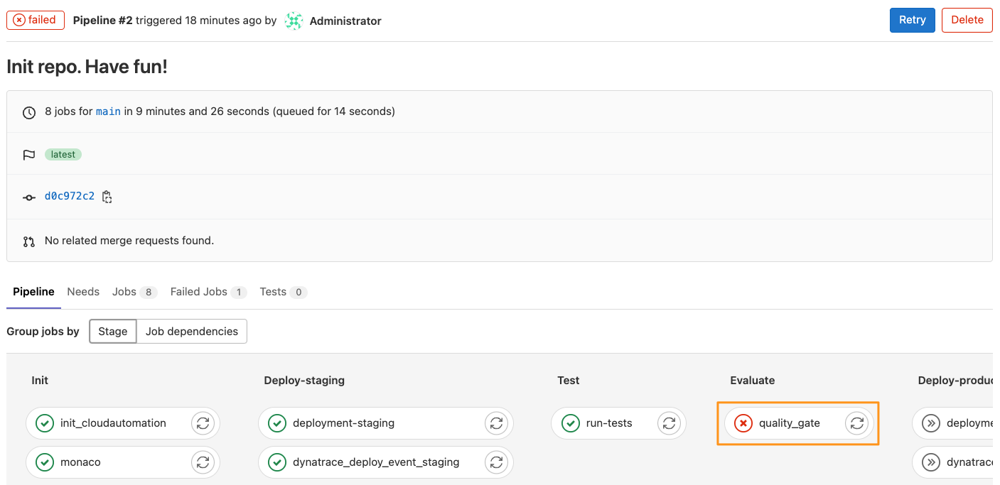
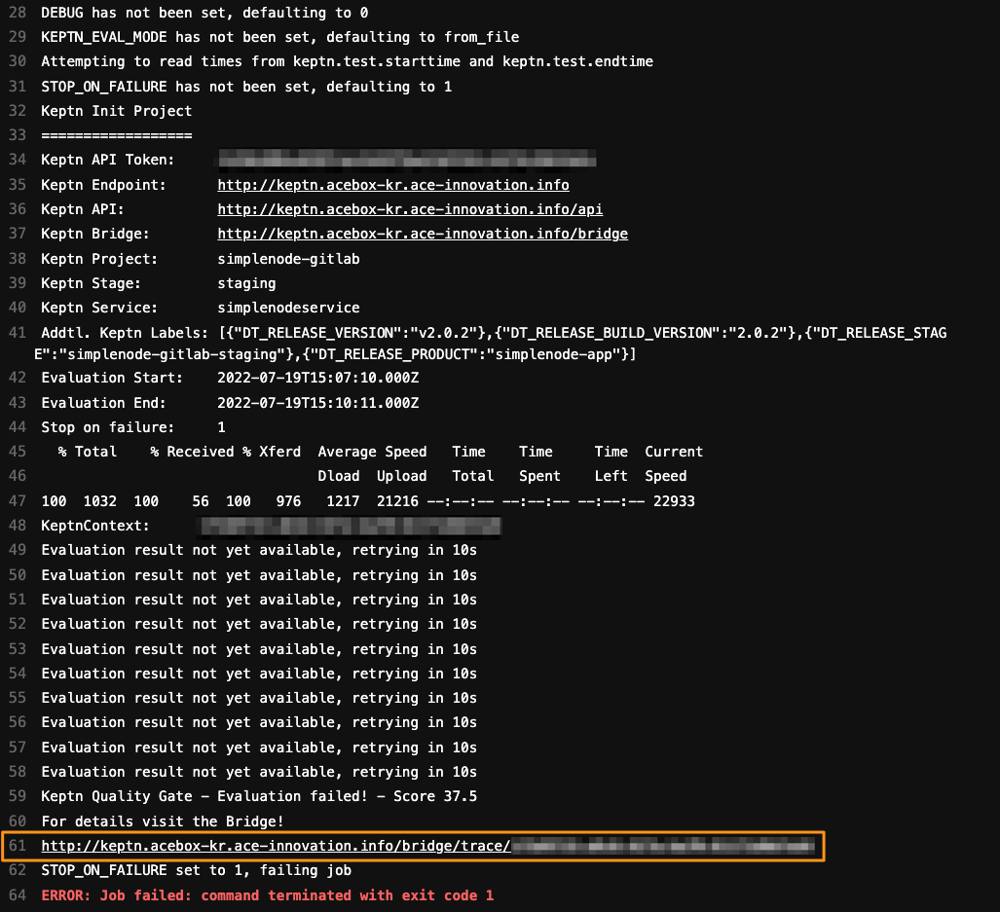
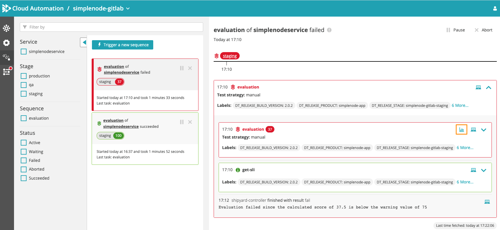
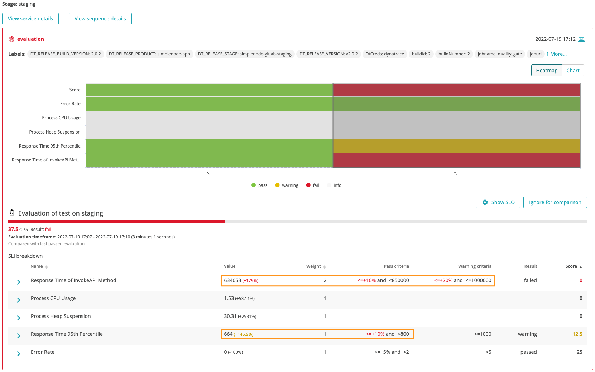

# 2. Failed Build

During this step, we will deploy a Build of poor quality that will be stopped by an automated Quality Gate in staging. We will explain where the Quality Gates are defined and how Cloud Automation leverages them to verify the desired behaviour against the current situation. By the end of this exercise, the poor build will have been deployed to staging and a failed quality gate will stop it from being promoted to production.

## Deploying a bad build

1. Navigate to `CI/CD` on the left menu and click on the the blue `Run pipeline` button.
    

2. Set the `BUILD_ID` variable to `2`. This will control the deployment of the bad build. Click on `Run pipeline`. 
    > Note: This process will take about 10 minutes to complete. For a customer demo it is recommended to launch this step prior to the start of the session, this will result in it completing during the demonstration.

    

## A failed build

1. After about 10 minutes, you will notice that the pipeline has failed:
    

2. Click on the failed pipeline to open the details. Notice how the `quality_gate` job in the `Evaluate` stage failed. 
    

3. Click on the `quality_gate` job to open the details. This will produce the console output of the agent running the job.
    

4. Near the end of the output, you can see the details of the evaluation. Notice the score was printed (37.5) in this case. There is also a link to the Bridge for the evaluation details. Click on that link.

5. The Bridge opens to the evaluation results of the corresponding pipeline run. Click on the graph icon to open the Heatmap and details of the evaluation.
    

6. The evaluation details present themselves. Investigate the individual **Service Level Indicators (SLIs)**, the values, and how they correspond to the **Service Level Objectives**
    

## Approaching the failed build analysis from Dynatrace

We approached the failed build above starting from the CI Pipeline run in GitLab. Alternatively, we can also approach this from the Dynatrace side. To do that, open the **Releases** screen in Dynatrace, and follow the steps outlined in [1. Succesful Build - Execution Details](1_successful_build.md#execution-details)

## (Optional): Deploying a successful build again

If wanted, you can follow the steps outlined in [Deploying a bad build](#deploying-a-bad-build) to deploy a fast build by setting the `BUILD_ID` variable to `1` or `3`

## Next Steps
Navigate to [3. Evaluation Explained](3_evaluation_explained.md) to gather details on how the Evaluation Was Performed.