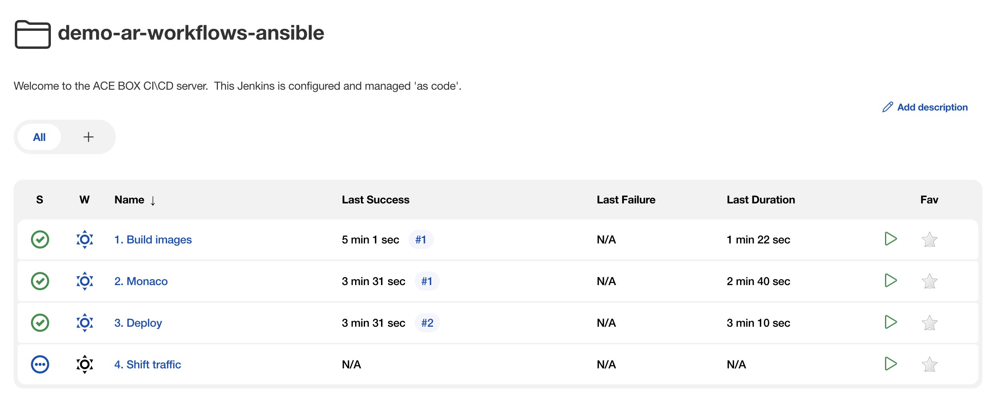
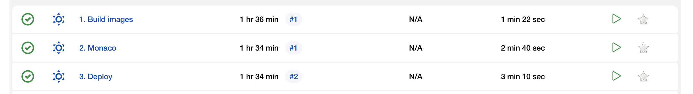

### Use case: Auto Remediation of a failed canary deployment

# Prepare environment

Before we get started with the actual use case, we leverage a Jenkins pipeline to prepare our demo environment. All pipelines that we use as part of this use case can be found in Jenkins, project _demo-ar-workflows-ansible_.



## 1. One click build and deploy images

> Note: This step is optional as images are built by default when the use case was provisioned. If you want to manually re-trigger a build and deployment, follow this guide.

In order to get started, go to the project overview in Jenkins and trigger the first pipeline, _1. Build images_. This pipeline will do a couple of things:

- Two versions of [_Simplenodeservice_](../10_simplenodeservice/README.md) are built and pushed to the local registry, build version "1" and "4". Build 1 will be the currently deployed and healthy "live" version of the app. Build 4 will become the app's new canary version, however introduces a response time degradation and failure rate increase. See app.js in git repo auto-remediation/ace-demo-canary for details.
- Two services are deployed, _Simplenodeservice_, build 1, and _Simplenodeservice_, build 4. The deploying pipeline _3. Deploy_ is triggered automatically after each successful build. For now, all traffic is routed to *build 1*.
- Additionally, a pipeline is started to configure Dynatrace leveraging Dynatrace Configuration as Code (Monaco). Monaco deploys up use case relevant resources in your Dynatrace environment.

Eventually, _01. Build images_, _2. Monaco_ and _3. Deploy_ jobs should have run successfully which can be verified in the project overview:



At this point, the live version of your service should be available at:

```
http(s)://simplenodeservice-canary-jenkins.<ingress domain>
```

Go ahead and make sure all required Dynatrace configurations are applied in the [next step](../02_configure_dynatrace/README.md). 