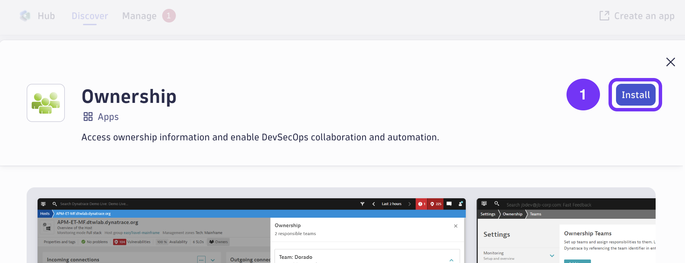

### Use case: Auto Remediation of a failed canary deployment

# 01 - Preparations

As part of an initial deployment pipeline that sets up resources in Kubernetes, a Monaco (Monitoring-as-Code) pipeline takes care of configuring Dynatrace. At this point Dynatrace recognizes services and understands how the performance baseline for our service should look like. Additionally, we have to enable a few global settings.

## 1. Allow AutomationEngine to access Ansible (AWX)

As part of the remediation workflow, Dynatrace reaches out to Ansible (AWX). In order to allow such an outbound connection, please go to _Settings > Preferences > Limit outbound connections_ and add your host IP or domain to the allow-list:

## 2. Install Dynatrace Ownership App

The auto remediation demo leverages a built-in Dynatrace App. In order to run the demo, please head to the Hub in your environment, search for the "Ownership" App and install it.

Congrats! You're now ready to [trigger the canary deployment](../03_shift_traffic)!
