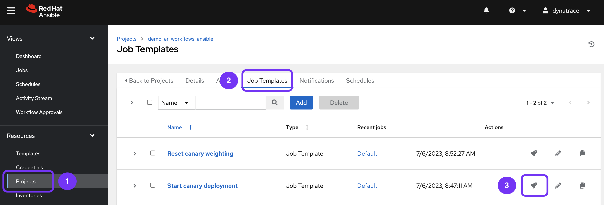
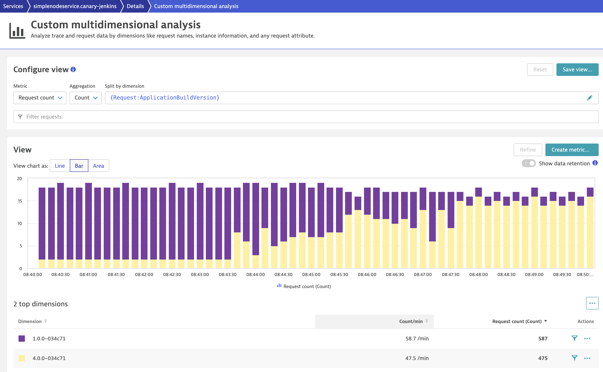
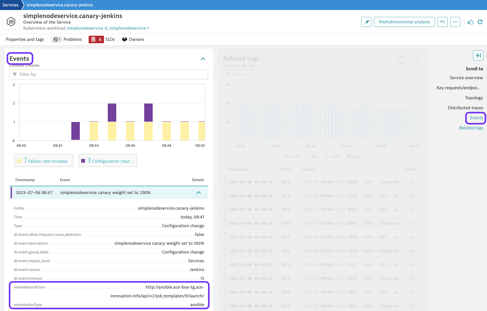

### Use case: Auto Remediation of a failed canary deployment

# Shift traffic

At the moment, a simple load generator is calling the service's ingress. Although both versions (*build 1* and faulty *build 4*) of our service are deployed, 100% of the traffic is routed to *build 1*, the current "live" version. We can now start to shift traffic to the service's canary version (*build 4*).

## 1. Use AWX to route traffic to the canary

1. Go to AWX (see the dashboard for credentials)
2. Under "Projects", open the "demo-ar-workflows-ansible" Project 
3. Under "Job Templates", launch "Start canary deployment" with it's default settings

    

A playbook is run which slowly increases the percentage of traffic that is routed to the canary. With each incremental step an event is pushed to Dynatrace to make it aware of the service's configuration change. When you visit the application in your browser ( `http(s)://simplenodeservice-canary-jenkins.<ingress domain>` ) the likelyhood of reaching the new service is steadily increasing up to the point where you'll only see the new version.

## 2. Inspect traffic shift in Dynatrace

This shift in traffic can also be inspected in Dynatrace:

1) In your Dynatrace tenant, navigate to **Services** and search for "simplenodeservice.canary-jenkins". Alternatively, you can  filter by `Tag:[Environment]DT_RELEASE_STAGE:canary-jenkins`.
2) Select service "simplenodeservice.canary-jenkins"
3) Click on "Multidimensional analysis".
4) Select metric "Request count", aggregation "Count" and split by dimension `{Request:ApplicationBuildVersion}`

    Expected view:

    

You can see that the request count for service *build 1* is steadily decreasing while simultaneously increasing for service *build 4*.

Additionally, as part of our change management process, we also send events to Dynatrace highlighting this. This can be observed in the _Events_ section of _simplenodeservice.canary-jenkins_:

In this event we also specify a potential backout plan, a remediation type and action in case that this change causes problems for our application and its users. This very metadata will later be leveraged for the auto remediation flow.

All set. you can now watch the [auto remediation in action](../04_auto_remediation).
