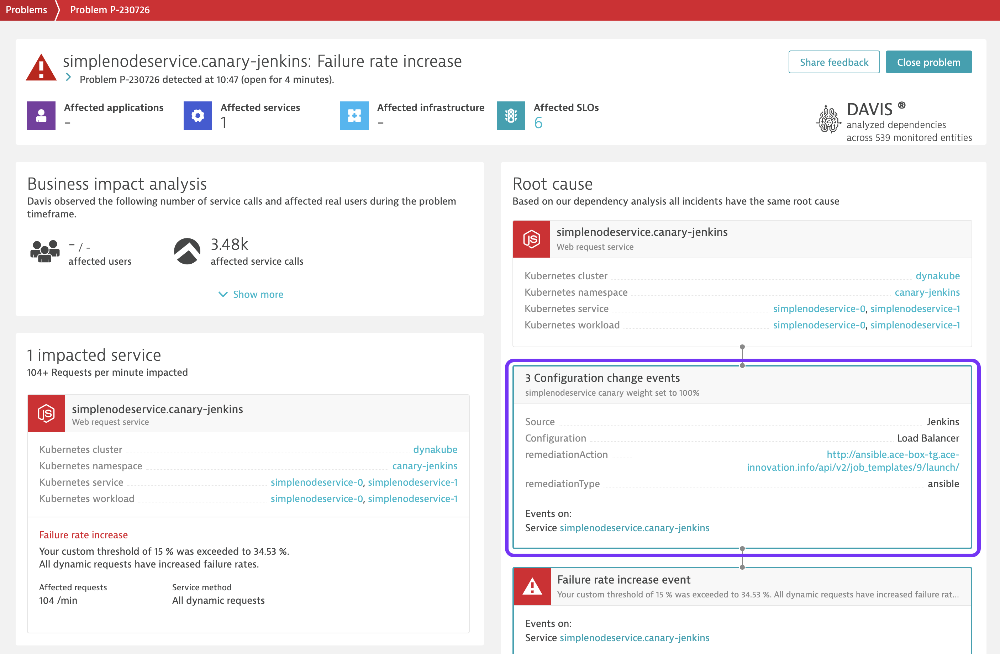
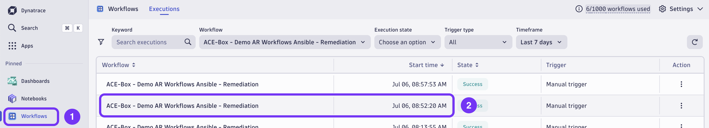
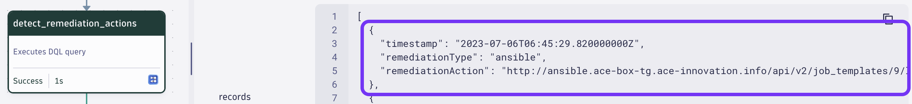

### Use case: Auto Remediation of a failed canary deployment

# Auto-remediation

As the percentage of traffic routed to the faulty canary version of the service is increased, Dynatrace will detect an increase in failure rate, open a problem and subsequently run a remediation workflow.

## 1. Wait for problem to be opened

Within a couple of minutes Dynatrace detects an anomaly in failure rate and openes a problem. As soon as a problem is opened, Dynatrace's Davis AI starts analysing and correlating entities and events. Which allows us to easily identify a root cause for our issue:

Note that Dynatrace identifies the Configuration Change events that we sent as part of our canary shift as the root cause. Those events include metadata about the remediation action that can be executed in Gitlab.

## 2. Inspect AutomationEngine workflow execution

Immediately after the root cause is identified, a workflow is triggered. Find our auto remediation in the list of workflow executions: 

>Note: You might see multiple executions from multiple workflows. Feel free to filter for the workflow we're particularly interested in: _ACE-Box - Demo AR Workflows Ansible - Remediation_.

Understand the workflow: As part of a problem lifecycle, Dynatrace ingests events for every problem update, for example a change in problem status. For every cycle, the workflow is triggered exactly twice. A first time when a problem is opened (and a root cause is identified) and a second time when a problem is resolved:

### Problem opened
    
When a problem is initially opened, usually the root cause is not yet known. At this point Dynatrace Davis AI analyzes the problem and all contextual information that's available, eventually identifying a root cause. The very problem update event which includes a root cause for the first time tells our workflow to try an auto remediation:

1) Configuration change events are queried for the detected root cause entity. Each event is parsed for metadata that specifies a remediation type and action. In our case, an event is identified which was sent earlier when Jenkins changed the canary weighting:

    

2) The remediation type was furthermore identified as _ansible_, so Dynatrace goes ahead and triggers the Ansible based remediation.
3) In parallel, retrieves ownership metadata from the identified root cause entity (Please find more information about ownership in the [Dynatrace docs](https://www.dynatrace.com/support/help/manage/ownership)). This task can be used to e.g. notify owners about the remediation.
4) From this point on, remediation updates are added to the Dynatrace Problem in the form of comments.

After the remediation ran, Dynatrace will detect the improvement in service performance and close the issue. The issue close event will  run the remediation workflow a second time. This time, instead of triggering the remediation action, the previouly created Gitlab issue will be updated and closed.

This marks the end of the auto remediation flow.
