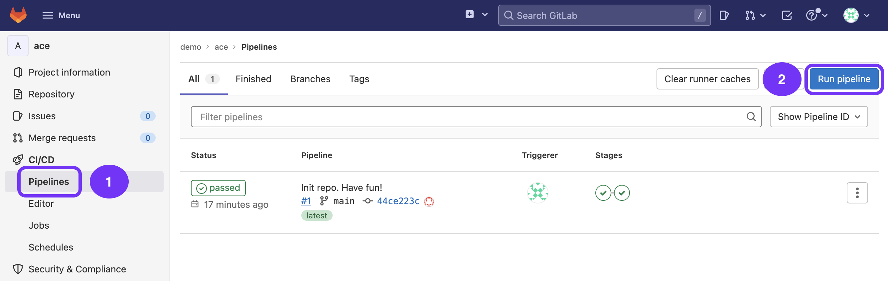
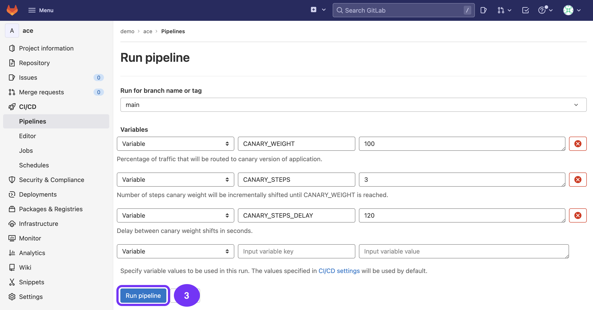

### Use case: Canary + auto remediation

# 02 - Canary shift

You're now ready to run the auto remediation demo. The following demo can be repeated as many times as desired (as long as frequent issue detection is disabled, see previous step).

## 1. Trigger Canary Shift

A Gitlab pipeline has been set up that allows us to shift the percentage of traffic that is routed to each of the deployed services (canary & non-canary). The pipeline does a few things:

  1) Identify canary and non-canary version of the service
  2) Increase weighting of canary service
  3) Send a configuration event to the Dynatrace service
  4) Sleep for a pre-configured amount of seconds to gain statistical confidence in performance of canary service for current traffic weighting.
  5) Repeat steps 1-4 until target canary wight is reached.

Go ahead and run a new pipeline:

The following inputs are available:

- Canary weight: Target percentage of traffic that will be routed to the canary version of our service.
- Canary steps: number of steps the shift will be conducted in. For example: If this value is set to `3`, the current canary weight is `0` and the target canary weight is `100`, the pipeline will run three iterations in which the canary weight will slowly shifted in steps of `33`, `66` and `100` percent.
- Canary steps delay: Number of seconds the pipeline waits between shifting traffic.

Leave the defaults and run the pipeline:

Congrats! You're now ready to [see the auto remediation in action](/03_auto_remediation)!
